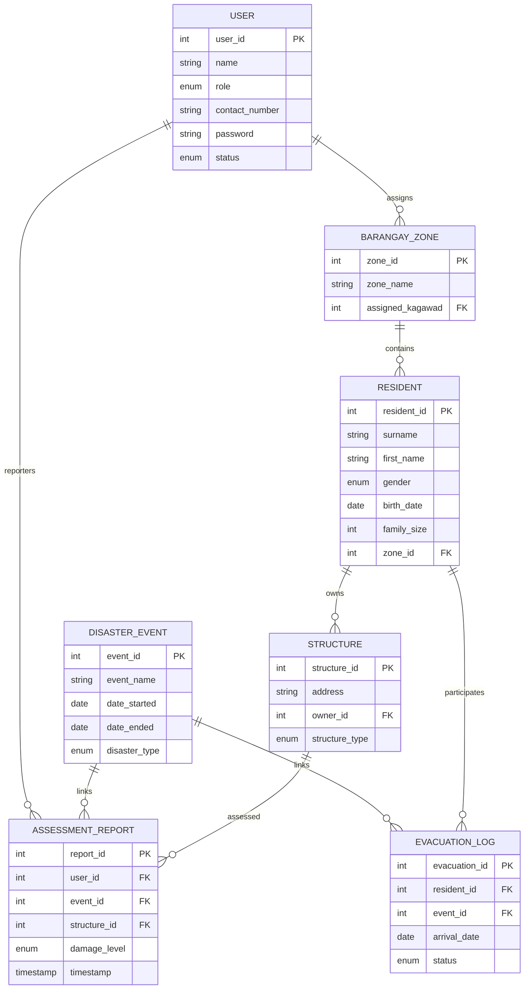

# AgapaySF Database Documentation

This document provides a comprehensive technical overview of the AgapaySF database system, prepared for academic and professional reference.

## 1. Entity-Relationship Diagram (ERD)



---

## 2. Relational Schema (RS)

The normalized relational schema (3NF) is as follows:

- **USER** (**user_id**, name, role, contact_number, password, status)
- **DISASTER_EVENT** (**event_id**, event_name, date_started, date_ended, disaster_type)
- **BARANGAY_ZONE** (**zone_id**, zone_name, *assigned_kagawad*)
- **RESIDENT** (**resident_id**, surname, first_name, middle_initial, gender, birth_date, contact_number, family_size, senior_citizen_count, fourPs_member_count, baby_count, infant_count, pregnant_count, pwd_count, *zone_id*)
- **STRUCTURE** (**structure_id**, address, *owner_id*, structure_type)
- **ASSESSMENT_REPORT** (**report_id**, *user_id*, *event_id*, *structure_id*, damage_level, photo_url, timestamp)
- **EVACUATION_LOG** (**evacuation_id**, *resident_id*, *event_id*, arrival_date, departure_date, status)

---

## 3. Data Dictionary

### Table: USER
| Column | Data Type | Constraints | Description |
|--------|-----------|-------------|-------------|
| user_id | SERIAL | PRIMARY KEY | Unique identifier for users |
| name | VARCHAR(100)| NOT NULL | Full name of the user |
| role | user_role | ENUM | Kagawad, Staff, or Admin |
| contact_number | CHAR(11) | UNIQUE, NOT NULL | PH Mobile number |
| status | user_status | ENUM (Default: PENDING) | Account approval status |

### Table: RESIDENT
| Column | Data Type | Constraints | Description |
|--------|-----------|-------------|-------------|
| resident_id | SERIAL | PRIMARY KEY | Unique identifier for residents |
| surname | VARCHAR(30) | NOT NULL | Family name |
| family_size | INTEGER | CHECK >= 1 | Number of members in household |
| zone_id | INTEGER | REFERENCES BARANGAY_ZONE | Residential zone |

---

## 4. Relational Tables w/ Sample Data

### USER (Sample)
| user_id | name | role | contact_number | status |
|---------|------|------|----------------|--------|
| 1 | Juan Dela Cruz | Admin | 09123456789 | ACTIVE |
| 2 | Maria Santos | Kagawad | 09223334444 | ACTIVE |

### BARANGAY_ZONE (Sample)
| zone_id | zone_name | assigned_kagawad |
|---------|-----------|------------------|
| 1 | Zone 1 | 2 |
| 2 | Zone 2 | 3 |

---

## 5. SQL Queries

### A. Data Definition Language (DDL)
```sql
CREATE TYPE user_role AS ENUM ('Kagawad', 'Staff', 'Admin');

CREATE TABLE "USER" (
    user_id SERIAL PRIMARY KEY,
    name VARCHAR(100) NOT NULL,
    role user_role,
    contact_number CHAR(11) NOT NULL UNIQUE,
    password VARCHAR(255) NOT NULL,
    status user_status NOT NULL DEFAULT 'PENDING'
);
```

### B. Data Manipulation Language (DML)
```sql
-- Insert a new disaster event
INSERT INTO DISASTER_EVENT (event_name, date_started, disaster_type) 
VALUES ('Typhoon Pepito', CURRENT_DATE, 'Typhoon');

-- Update resident status
UPDATE EVACUATION_LOG SET status = 'Returned', departure_date = CURRENT_DATE 
WHERE resident_id = 5 AND status = 'Evacuated';
```

### C. Indexes
```sql
-- Improve lookup speed for contact numbers
CREATE INDEX idx_user_contact ON "USER"(contact_number);

-- Speed up filtering assessments by event
CREATE INDEX idx_assessment_event ON ASSESSMENT_REPORT(event_id);
```

### D. Stored Procedures
```sql
-- Procedure to end a disaster event safely
CREATE OR REPLACE PROCEDURE end_disaster_event(p_event_id INT)
LANGUAGE plpgsql
AS $$
BEGIN
    UPDATE DISASTER_EVENT 
    SET date_ended = CURRENT_DATE 
    WHERE event_id = p_event_id;
    
    -- Auto-return all residents still marked as evacuated
    UPDATE EVACUATION_LOG 
    SET status = 'Returned', departure_date = CURRENT_DATE 
    WHERE event_id = p_event_id AND status = 'Evacuated';
END;
$$;
```

### E. Triggers
```sql
-- Trigger to ensure timestamps are never manually regressed
CREATE OR REPLACE FUNCTION protect_report_timestamp()
RETURNS TRIGGER AS $$
BEGIN
    IF NEW.timestamp < OLD.timestamp THEN
        RAISE EXCEPTION 'Cannot set timestamp to an earlier date';
    END IF;
    RETURN NEW;
END;
$$ LANGUAGE plpgsql;

CREATE TRIGGER trg_protect_timestamp
BEFORE UPDATE ON ASSESSMENT_REPORT
FOR EACH ROW EXECUTE FUNCTION protect_report_timestamp();
```
